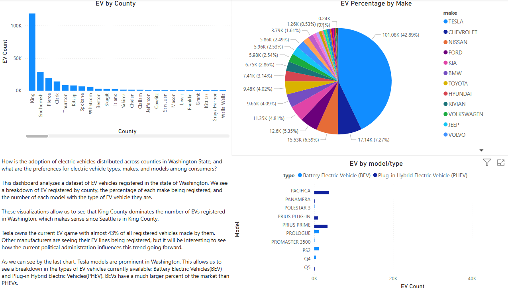

# EV Vehicles Registered in Washington State (Power BI)

## Overview
This Power BI dashboard explores electric vehicles registered in the state of Washington. It provides the count of vehicles registered by county, the percentage of each make, and the models and types that are dominant in Washington.

---

## Data Sources

All data used for Power BI visualizations was generated from MS SQL queries in SSMS(SQL Server Management Studio 2.0).

ev_make_model.csv: Percentage of EV make

ev_type.csv: EV Models and Type

total_ev_by_county.csv: Count of EV by county

---

## Key Insights

### 1. Percentage of EV make
- Tesla is dominating the EV landscape in Washington

---

### 2. EV Models and Type
- Tesla rules Washington with their different models and type which is Battery Electric Vehicles(BEVs) .

---

### 3. Count of EV by county
- King County has the most registered EV in the state.

---

## Tools/Sites Used
- Data.gov
- Excel
- SSMS
- Power BI

---

## Screenshot

---

## Insights & Observations

- King County leads Washington in EV adoption, with over 100K registered electric vehicles — significantly more than any other county. This aligns with Seattle's large population and progressive infrastructure.

- Tesla overwhelmingly dominates the EV market in Washington, accounting for nearly 43% of all electric vehicle registrations — more than 5x the next most common brand.

- BEVs (Battery Electric Vehicles) are more common than PHEVs (Plug-in Hybrid Electric Vehicles), reflecting a growing consumer preference for fully electric vehicles over hybrids.

- Only a few vehicle models account for a significant portion of registrations, while many other models have minimal adoption, suggesting consumer concentration around trusted or higher-performing EVs.

- EV ownership is heavily concentrated in urban and suburban counties, such as King, Snohomish, and Pierce. More rural counties show significantly lower adoption, possibly due to infrastructure or income disparities.

- Model type trends mirror make dominance — Tesla models appear prominently in the BEV category, reinforcing their brand's leadership in the fully electric market.

---

## Additional Notes

This was my first attempt at extracting a dataset from Data.gov, cleaning it in Excel, querying it in SSMS, and then visualizing it in Power BI.

I learned many things going through this process:

- Unless you have a work or school account, you cannot log into Power BI and publish your dashboards/workbooks to the web. I am instead using GitHub as my primary way of displaying this dashboard.

- I need to work on enhancing my dashboards and visualizations to make them more interactive. Once I finish my Looker Studio project, I will pick a visualization tool and workflow to focus on.(at the moment, Tableau seems like the best option)

- I need to fix my resume, update my LinkedIn and Indeed, and start looking for jobs while working on these projects. I can study and make my own visualizations all day, but I need real world application...and MONEY!

## Future Focus

- Better data analysis
- Better visualizations(colors, themes, consistency)
- Resume/LinkedIn/Indeed
- Projects need more polish and to demonstrate: vlookup, pivot tables, DAX, window queries, CTEs, JSON, arrays)

---

## Author
Created by [James Mosher](https://www.linkedin.com/)

